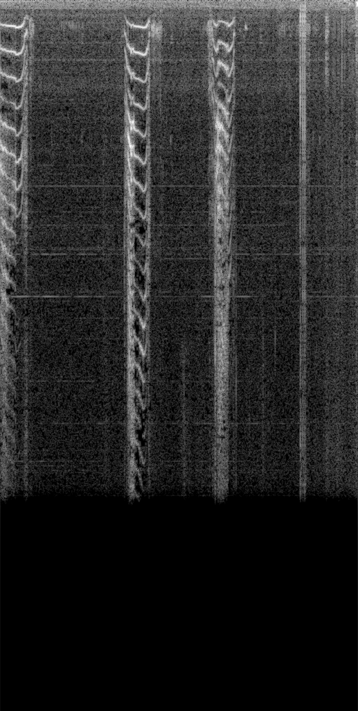

# Audio to Spectrogram Converter

<a href="https://www.buymeacoffee.com/hdnh2006" target="_blank"></a>


This Python script converts audio files to spectrogram images. It uses the `librosa` library for audio processing and `cv2` for image manipulation. The converted spectrograms are saved as PNG images.

Dataset cats and dogs source: https://www.kaggle.com/datasets/mmoreaux/audio-cats-and-dogs

This code will convert almost any audio to spectogram.

## Spectrograms
A spectrogram is a visual representation of the frequencies present in an audio signal over time. It provides a way to analyze the frequency content of a sound and how it changes over different time intervals. Spectrograms are widely used in various fields, including audio processing, speech recognition, music analysis, and more.

Spectrograms are created by performing a mathematical transformation called the Fourier transform on small segments of an audio signal. This transformation converts the signal from the time domain to the frequency domain. The resulting representation displays the magnitude or power of each frequency component present in the signal at different time intervals.

## What can this code do for you?
- Convert audio to images.
- Almost all sources supported: '.wav', '.mp3', '.m4a', etc.

Play this audio
[Link to Video]https://raw.githubusercontent.com/hdnh2006/get_spectogram/main/assets/cat_160.mov


The spectogram for this audio is this image
<div align="center">
  
</div>


## Requirements

- Python 3.x
- `librosa`
- `cv2`
- `argparse`
- `tqdm`

## Installation

1. Clone the repository:

```
git clone https://github.com/hdnh2006/AudioToSpectogram.git
```
  
2. Install the required packages:

```
pip install -r requirements.txt
```


## Usage

```
python audio_to_spectrogram.py --source [source_folder] --duration [duration] --output [output_folder]
```
- source_folder: Path to the folder containing the audio files. Default: "cats_dogs".
- duration: Duration of the audio files to process in seconds. Default: 60.
- output_folder: Path to the folder where the spectrogram images will be saved. Default: "output".

## Examples
python audio_to_spectrogram.py --source cats_dogs --output spectrograms

## About me and contact

This code is based on the YOLOv5 from Ultralytics and it has been modified by Henry Navarro
 
If you want to know more about me, please visit my blog: henrynavarro.org.
