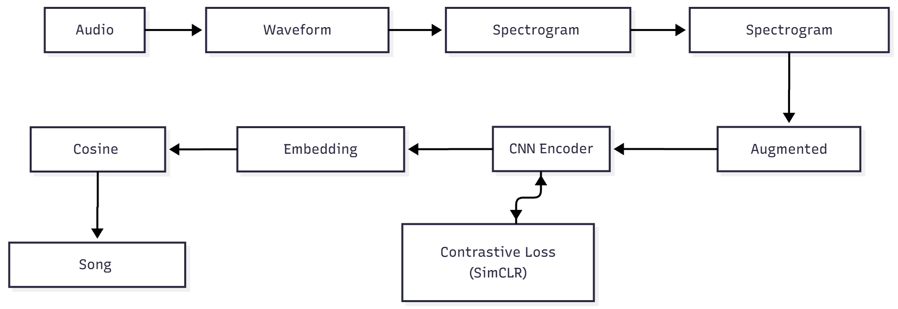

# Music Classification and Recommendation System
## Self-Supervised Learning on Audio Spectrograms

[](https://www.python.org/downloads/)
[](https://pytorch.org/)
[](LICENSE)

A deep learning project that uses self-supervised contrastive learning on audio spectrograms to classify music and recommend similar songs based on learned embeddings.

---

## 📚 Documentation

Detailed documentation and guides have been moved to the `docs/` directory:

- **[Quickstart Guide](docs/QUICKSTART.md)**: Get up and running quickly.
- **[Audio Augmentation Guide](docs/QUICKSTART_AUDIO_AUGMENTATION.md)**: Specific guide for the audio augmentation pipeline.
- **[Augmentation Summary](docs/AUDIO_AUGMENTATION_SUMMARY.md)**: Technical details on the augmentation strategies.

---

## 🎯 Overview

This project implements a **self-supervised learning** approach to learn meaningful audio representations without requiring labeled data. By training a CNN encoder with contrastive learning on augmented spectrograms, the model learns to identify similar songs and can be used for:

- **Music Classification**: Categorize songs by genre, mood, or style
- **Song Recommendation**: Find similar songs based on audio features
- **Audio Similarity Search**: Retrieve songs that sound alike

The system leverages the power of **contrastive learning** to create robust audio embeddings that capture the essence of musical content.

---

## 📁 Project Structure

```
Music Classification by spectogram/
│
├── README.md                          # This file
├── docs/                              # Documentation and guides
├── configs/                           # Configuration files (YAML)
│   ├── model_config.yaml              # CNN architecture settings
│   ├── training_config.yaml           # Training hyperparameters
│   └── data_config.yaml               # Data processing settings
│
├── notebooks/                         # Jupyter Notebooks
│   └── Music_Classification_Training_Colab.ipynb  # Main training pipeline
│
├── CNN/                               # Core source code
│   ├── models/                        # Encoder & Projection Head
│   ├── augmentation/                  # Audio augmentations
│   ├── data/                          # Dataset & Dataloaders
│   ├── training/                      # Training logic
│   └── recommendation/                # Recommendation engine
│
├── AudioToSpectogram/                 # Preprocessing scripts
│   ├── output/                        # Generated spectrograms (gitignored)
│   ├── output_mel/                    # Generated Mel-spectrograms (gitignored)
│   └── fma_small_dataset/             # Dataset directory (gitignored)
│
└── requirements.txt                   # Project dependencies
```

---

## 🚀 Getting Started

### 1. Installation

```bash
# Clone the repository
git clone <repository-url>
cd "Music Classification by spectogram"

# Create virtual environment
python -m venv .venv
source .venv/bin/activate  # or .venv\Scripts\activate on Windows

# Install dependencies
pip install -r requirements.txt
```

### 2. Configuration

The project is fully configurable via YAML files in the `configs/` directory. Key settings include:

*   **`configs/data_config.yaml`**: Controls audio processing.
    *   *Default:* 3.0s duration, 128 mels, 22050Hz sample rate.
    *   *Dataset:* Points to `AudioToSpectogram/fma_small_dataset`.
*   **`configs/model_config.yaml`**: Defines the CNN architecture.
    *   *Default:* 4-block CNN encoder (64, 128, 256, 512 filters).
*   **`configs/training_config.yaml`**: Sets training hyperparameters.
    *   *Default:* 200 epochs, batch size 64, Adam optimizer (lr=0.001), NT-Xent loss (temp=0.5).

### 3. Training & Experimentation

The primary entry point for training and experimentation is the Jupyter Notebook:

**`notebooks/Music_Classification_Training_Colab.ipynb`**

This notebook covers the entire pipeline:
1.  **Data Loading**: Loads audio/spectrograms using settings from `data_config.yaml`.
2.  **Augmentation**: Visualizes and applies audio augmentations.
3.  **Model Initialization**: Builds the CNN encoder defined in `model_config.yaml`.
4.  **Training**: Runs the contrastive learning loop using `training_config.yaml`.
5.  **Evaluation**: Visualizes training curves and embeddings.

To run it:
```bash
jupyter notebook notebooks/Music_Classification_Training_Colab.ipynb
```

---

## 🏗️ Pipeline Architecture



### Pipeline Stages:

1. **Waveform Augmentation**: Apply pitch, tempo, noise, etc. to raw audio.
2. **Spectrogram Conversion**: Convert augmented audio to mel-spectrograms.
3. **Spectrogram Augmentation**: Apply masking and warping to the spectrogram.
4. **CNN Encoder**: Extract high-level audio features.
5. **Contrastive Learning**: Train with self-supervised contrastive loss.
6. **Embeddings & Search**: Generate embeddings and find similar songs.

---

## ✨ Key Features

### Self-Supervised Learning
- **No labels required**: Learn from raw audio data
- **Contrastive learning**: SimCLR-based approach
- **Data efficiency**: Learn robust representations with limited data

### Advanced Two-Stage Data Augmentation
The system implements a comprehensive augmentation pipeline to ensure robust feature learning:

**Stage 1: Waveform Augmentations (Raw Audio)**
*Randomly selects 3 per sample:*
1. **Pitch Shift**: ±1-3 semitones (Pitch invariance)
2. **Tempo Stretch**: ±5-12% speed change (Tempo invariance)
3. **Gain Adjustment**: ±3-6 dB volume change
4. **Parametric EQ**: Low-pass, high-pass, or bandpass filtering
5. **Dynamic Range Compression**: Reduces dynamic range
6. **Environmental Noise**: Adds background noise (SNR 10-30 dB)
7. **Convolutional Reverb**: Simulates room acoustics

**Stage 2: Spectrogram Augmentations (Mel-Spectrogram)**
*Randomly selects 2 per sample:*
1. **Time Masking**: Masks random time steps (SpecAugment)
2. **Frequency Masking**: Masks random frequency bands (SpecAugment)
3. **Time Warping**: Deforms the time axis for robustness

*Note: No axis flips or color jittering are used to preserve musical structure.*

### Robust CNN Encoder
- Deep convolutional architecture optimized for spectrograms
- Learns hierarchical audio features
- Produces compact, discriminative embeddings

### Efficient Recommendation System
- Fast cosine similarity search
- Scalable to large music databases
- Real-time song recommendations

---

## 🤝 Contributing

Contributions are welcome! Please follow these steps:

1. Fork the repository
2. Create a feature branch (`git checkout -b feature/amazing-feature`)
3. Commit your changes (`git commit -m 'Add amazing feature'`)
4. Push to the branch (`git push origin feature/amazing-feature`)
5. Open a Pull Request

---

## 📄 License

This project is licensed under the MIT License - see the [LICENSE](LICENSE) file for details.

---

## 🙏 Acknowledgments

- Audio conversion code adapted from [AudioToSpectogram](https://github.com/hdnh2006/AudioToSpectogram)
- SimCLR paper: [A Simple Framework for Contrastive Learning of Visual Representations](https://arxiv.org/abs/2002.05709)
- SpecAugment: [SpecAugment: A Simple Data Augmentation Method for Automatic Speech Recognition](https://arxiv.org/abs/1904.08779)

---

## 📧 Contact

For questions or feedback, please open an issue on GitHub.

---

**Happy Music Coding! 🎵🎶**
